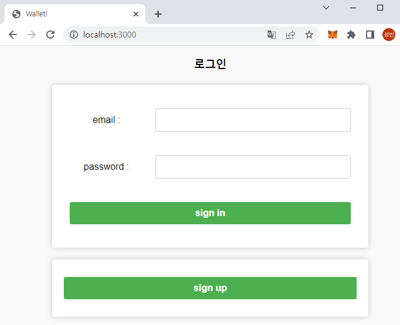
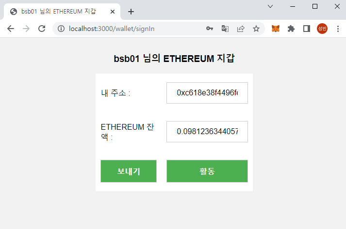
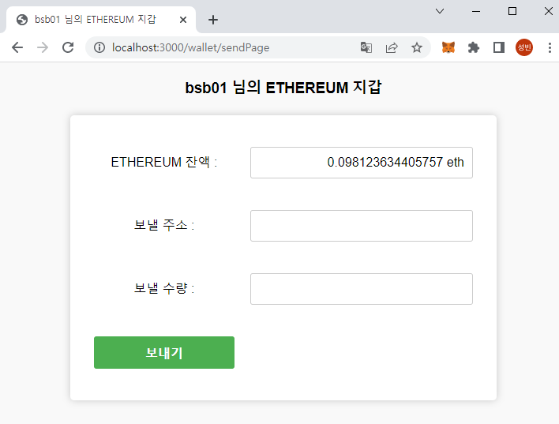
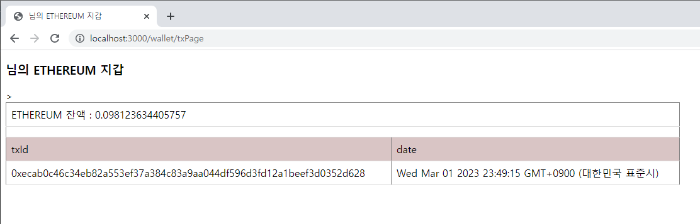

ethereumjs-wallet, ethereumjs-tx, web3 모듈을 사용한 간단한 이더리움 월렛 만들기 입니다.

<<<<<<< HEAD
=======
node version : v18.14.2 database : mysql
>>>>>>> bsb-003-wallet003

실행 방법

1. npm install

2. RDB 데이터베이스 및 테이블 생성(sql.txt 파일 참고)

3. https://infura.io/ 회원 가입 후 API KEY 생성

4. Network Endpoints goerli로 변경 후 주소 복사 (기존에는 ropsten 으로 진행하였으나 변경 됨)

5. .env 파일 생성 PASSWORD_SECRET=암호화키 db_pw=데이터베이스pw api_key=Infura Project ID(4에서 복사한 API KEY)

6. npm run dev

로그인 화면
#

메인 화면
#

전송 화면
#

거래 내역 화면

